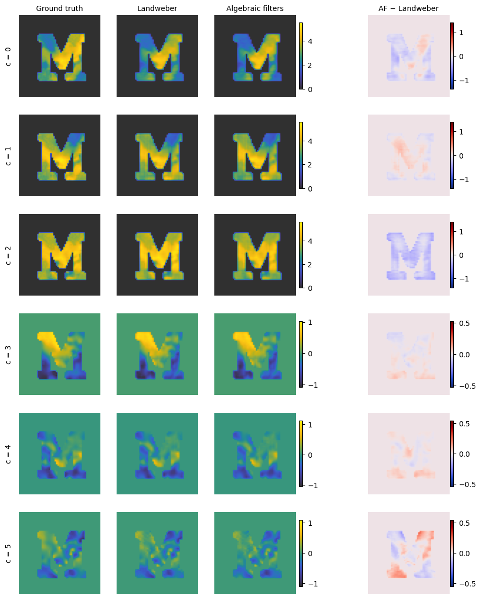

# Algebraic filters for X-ray scattering tensor tomography

[](https://doi.org/10.1364/OE.597352)
[](https://arxiv.org/abs/2607.19124)
[](https://mybinder.org/v2/gh/mesqant/algebraic-filters-tt/main?urlpath=lab/tree/notebooks/01_representations.ipynb)
[](https://github.com/mesqant/algebraic-filters-tt/actions/workflows/ci.yml)
[](LICENSE)

Companion notebooks to

> A. Mesquita Antunes, D. M. Pelt, and K. J. Batenburg,
> **Fast reconstruction of tensor tomographic X-ray scattering data for real-time applications**,
> *Optics Express* (2026). [doi:10.1364/OE.597352](https://doi.org/10.1364/OE.597352) · [arXiv:2607.19124](https://arxiv.org/abs/2607.19124)

The paper computes *algebraic filters* that make a single filtering + back-projection step approximate $k$ Landweber
iterations for tensor tomography. The method separates the tomographic projector $\overline{W}$ from a
view-dependent mixing operator $Y$ ($A = \overline{W}Y$), so it applies to any tensor representation and scattering
modality. These notebooks give a complete implementation for the simulated 'M' phantom: representation changes,
forward models, filter computation and reconstruction.



## Notebooks

| Notebook | Content | Paper | Run |
|---|---|---|---|
| [01 · Representations](notebooks/01_representations.ipynb) | Spherical harmonics → directional (7 directions) → rank-2 tensor | Sec. 4.1, Figs. 2–3 | [](https://colab.research.google.com/github/mesqant/algebraic-filters-tt/blob/main/notebooks/01_representations.ipynb) [](https://nbviewer.org/github/mesqant/algebraic-filters-tt/blob/main/notebooks/01_representations.ipynb) |
| [02 · Forward models](notebooks/02_forward_models.ipynb) | Projector $\overline{W}$, mixing operators $Y$ for the three representations, simulated projections | Sec. 2.2, 3.2 | [](https://colab.research.google.com/github/mesqant/algebraic-filters-tt/blob/main/notebooks/02_forward_models.ipynb) [](https://nbviewer.org/github/mesqant/algebraic-filters-tt/blob/main/notebooks/02_forward_models.ipynb) |
| [03 · Algebraic filters](notebooks/03_algebraic_filters.ipynb) | Step size (power method), Landweber, filters (Algorithm 1), AF reconstruction (Algorithm 2), comparison | Sec. 3, Figs. 4–5 | [](https://colab.research.google.com/github/mesqant/algebraic-filters-tt/blob/main/notebooks/03_algebraic_filters.ipynb) [](https://nbviewer.org/github/mesqant/algebraic-filters-tt/blob/main/notebooks/03_algebraic_filters.ipynb) |
| [04 · Runtime benchmark](notebooks/04_runtime_benchmark.ipynb) | Landweber vs. AF runtimes and speed-ups (GPU recommended) | Fig. 7 | [](https://colab.research.google.com/github/mesqant/algebraic-filters-tt/blob/main/notebooks/04_runtime_benchmark.ipynb) [](https://nbviewer.org/github/mesqant/algebraic-filters-tt/blob/main/notebooks/04_runtime_benchmark.ipynb) |

Run the notebooks in order: each one caches its results in `data/` for the next. The committed outputs come from a
full-size GPU run (NVIDIA RTX 4070 Super).

## Running the notebooks

The notebooks use a GPU (via [CuPy](https://cupy.dev) and mumott's CUDA projector) when one is available and fall
back to the CPU otherwise.

| Where | Hardware | What runs |
|---|---|---|
| **Binder** (badge above) | CPU, ~2 GB RAM | Small mode: every 4th of the 417 views; notebook 04 runs a reduced benchmark. Notebooks 01–03 take a few minutes. |
| **Google Colab** (badges in the table) | Free GPU: pick *Runtime → Change runtime type → T4 GPU* | Full size, as in the paper. The first cell clones this repository and installs mumott. |
| **Locally** | CPU or NVIDIA GPU | Full size on a GPU, small mode on a CPU. Set `ALGF_SMALL=1` to force small mode. |

Local installation with conda:

```bash
git clone https://github.com/mesqant/algebraic-filters-tt
cd algebraic-filters-tt
conda env create -f environment.yml
conda activate algfilters-tt
pip install cupy-cuda12x   # optional, for NVIDIA GPUs (use cupy-cuda11x for CUDA 11)
jupyter lab notebooks/
```

or with pip: `pip install -r requirements.txt`.

The pinned versions follow the environment used for the paper (Python 3.11, NumPy 1.26, SciPy 1.16, mumott 2.1).
**SciPy must stay below 1.17**, because mumott 2.1 uses `scipy.special.sph_harm`, which SciPy 1.17 removes.

## Data

Notebook 01 downloads the simulated 'M' tensor phantom (180 MB) from Nielsen et al.,
[doi:10.5281/zenodo.7673985](https://doi.org/10.5281/zenodo.7673985). The experimental datasets of Sec. 4.2 are not
part of this repository. The trabecular bone SASTT dataset (Nielsen et al., 2019) and the PMMA box with carbon fibre
bundles GITT dataset (Kim & Marone, 2021) are publicly available; see refs. 38–39 and the *Data availability*
section of the paper.

## Relation to the paper

The code reproduces the computations behind the paper's figures. Where it differs from the paper's text in
presentation or convention, the notebook says so in a `# Note:` comment:

- **Iteration count.** Starting from the term $\alpha A^\top b$, $k$ iterations sum $k+1$ terms of Eq. (10).
  The iterative and AF reconstructions use the same convention, so they approximate the same iterate.
- **Directional representation.** Values are taken at the nearest point of a coarse spherical grid rather than
  exactly at the 7 directions.
- **Tensor representation.** The second moment (Eq. 14) is integrated with weights that differ from the solid-angle
  element by a constant factor, which rescales all entries uniformly.
- **Convolution.** Filters are applied as convolutions, as in the paper. The filters are close to point-symmetric,
  and applying them as correlations changes the result by less than 0.1%.

## Citation

If you use this code, please cite the paper:

```bibtex
@article{mesquitaantunes2026fast,
  title   = {Fast reconstruction of tensor tomographic {X}-ray scattering data for real-time applications},
  author  = {Mesquita Antunes, Andr{\'e} and Pelt, Dani{\"e}l Maria and Batenburg, Kees Joost},
  journal = {Optics Express},
  year    = {2026},
  doi     = {10.1364/OE.597352}
}
```

GitHub's *Cite this repository* button (from [`CITATION.cff`](CITATION.cff)) gives the same reference.

## Acknowledgements

This work was funded by Horizon Europe through the MSCA Doctoral Network RELIANCE (grant no. 101073040).
The tomographic projector and spherical harmonic utilities come from [mumott](https://mumott.org).

## License

[MIT](LICENSE)
